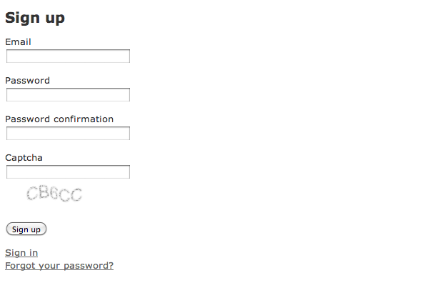

# Captcha Example App

By Ali El-Ashram

## Description

This is an example app I used to give a lighting talk on implementing the captcha gem in Rails 3. I shared this repo's url with my CodeFellows Ruby on Rails Bootcamp colleagues so that they would have access to the code I was discussing for later reference.

## Information

## License

MIT: http://aliel.mit-license.org/
